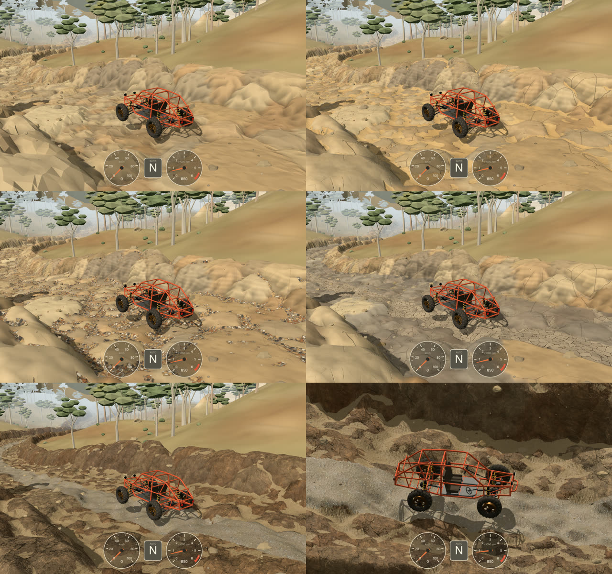

# Research: more realistic ground on the dry river

Goal: make the dry river bed look like real ground, not low-poly facets. The bed shape, the tyres
and the colliders must not change.

Answer: **yes, and mostly in the shader.** The shape of the bed is already good. What looks
artificial is the shading: hard 25 cm facets, one flat colour per boulder, and no loose material.
Four prototype looks are in `src/render/river-ground.js`. Select one with `?ground=<look>`.

## Today

The bed is one rock sheet (`terrain/rock-sheet.js`): a 25 cm jittered grid, flat-shaded, with one
vertex colour per boulder and darker creases. All the detail is in the geometry. So:

1. Every triangle shows as a facet. Up close it reads as low-poly, not as rock.
2. There is no detail below 25 cm: no grain, no cracks, no small stones.
3. The bed is all rock. A real dry river has sand, gravel and silt in its low places.
4. Banks and forest floor (the 1 m terrain mesh) are flat colours. This is visible in every view.

## What makes ground look real (most effect first)

1. **Material layers by place.** Rock where water scoured it. Sand, gravel and silt where they
   settle: hollows, creases between boulders, the low channel.
2. **Detail below the mesh resolution** (2–25 cm), in colour and in the normal.
3. **Smooth normals plus a detail normal**, not flat facets.
4. **Dark contact zones**: cracks, gaps between stones, the foot of a boulder.

## The masks (shared by all looks)

The chunk worker now adds two per-vertex attributes to the rock sheet (`rockSheetData`):

| Value | Meaning | Used for |
|---|---|---|
| `fill` | m below the mean of the 5 × 5 points around it (~1 m) | hollows: sand, silt |
| `rut` | 0..1, the low channel (`sample().rut`) | gravel, mud |
| `lift` | m of rock over the ground beneath (`sample().stone`) | creases between boulders |
| `dist` | m from the centre line | (free for banks, litter) |
| `aboveBed` | m over the bed floor (`sample().bedY`, new) | high-water line |

Cost: 20 bytes more per vertex, and a 5 × 5 average per point in the worker.

## The four examples

Screens: `docs/research/river-ground/` (`*-low.jpg`: low camera, `*-close.jpg`: close top view;
`facets-*` is today). Live: add `?terrain=river&ground=sand|cobbles|mud|pbr` to the game URL.

*Top left: today. Then sand, cobbles, mud, PBR (low), PBR (close).*

### A. Sandstone with wind-blown sand (`ground=sand`, procedural)

- Smooth normals. A bump from fractal noise (1.6 m and 15 cm) gives a chipped relief.
- Joints: the edges of Voronoi cells (1.1 m and 35 cm), broken up so only some edges crack.
- Sand fills the hollows and the creases. The rock's own relief decides where the sand edge runs.
  The sand has wind ripples (~9 cm) and a grain sparkle.
- Good: the bed reads as one large rock surface with sand in it. Close to the photo reference.
- Weak: crack lines are too even on the walls. Pure noise has no real rock structure.

### B. River cobbles and gravel (`ground=cobbles`, procedural)

- Rock is water-polished: smoother, less cracked, a little glossier.
- Hollows and the channel hold rounded cobbles (~10–15 cm, five rock types) and gravel (~3 cm)
  in grit. Each cobble is a rounded lump with a contact shadow.
- Good: strong "river" signal. Real scale cue for the car.
- Weak: the cobbles are only shading. The tyres feel no cobbles; at a low angle the flat
  silhouette shows. Busy in the far view.

### C. Cracked mud and the high-water line (`ground=mud`, procedural)

- The channel and the deepest hollows hold silt plates (~30 cm), cracked and curled up at the
  edges, with fine hairline cracks.
- Rock below ~55 cm over the bed floor is darker and greyer (the last flood), with a ragged edge.
  Dark streaks of desert varnish run down steep faces.
- Good: the water line is very cheap (one value per vertex) and tells the story of the river.
- Weak: the channel mask is wide (about ± 1.3 m), so mud covers much of the bed.

### D. Photo-scanned textures (`ground=pbr`)

- CC0 textures from ambientCG: Rock029 (sandstone), Ground054 (sand), 1K, colour + normal + one packed image (AO, roughness, height). `public/textures/river/`.
- Rock: triplanar, one tile per 2.5 m, normals by the whiteout blend. Sand: projected from above. Height blend: each texture's height map decides where the layer edge runs.
- Good: the most real detail per pixel, for the least shader work. Real roughness and AO.
- The first version also had a gravel strip down the low channel. It read as a road, so it is
  removed.
- Weak: the scanned rock is browner than the world's yellow sandstone (now tinted by each
  boulder's colour; needs a better-matched texture or a colour grade). Repeats can show on large
  flat areas. 3.7 MB of JPG as it is now.

## Cost

Not measured on a real GPU. The screenshots come from a headless browser with a software
renderer. Estimates from the shader code:

| Look | Per pixel | Notes |
|---|---|---|
| facets (today) | vertex colour, flat normal | cheapest |
| sand | ~25 value-noise lookups, 2 Voronoi (9 cells each) | too heavy for phones at full screen |
| cobbles | ~15 noise, 4 Voronoi | heavy |
| mud | ~18 noise, 4 Voronoi | heavy |
| pbr | 12 texture reads, ~6 noise | normal for a terrain shader |

Detail fades out where it is smaller than a few pixels (`detail()`), so far ground does not
shimmer. Textures use mipmaps and 8× anisotropic filtering.

## Recommendation

Use **D (textures) as the base**, and keep three cheap procedural parts from the others:

1. The masks (`fill`, `rut`, `lift`, `aboveBed`) and the height blend. They place each layer.
2. The high-water line from C (one value, no noise needed).
3. Maybe mud cracks from C in a few hollows. Not as a strip down the channel: a continuous
   strip reads as a road (as the gravel strip did).

Procedural noise everywhere (A–C) looks good but costs too much per pixel for the iPhone. Textures
give more detail for less work.

## Work plan

1. **Textures.** Find (or make) a yellower sandstone and a sand texture. Encode as
   KTX2 (Basis) in one texture array: smaller download, compressed in GPU memory.
2. **Rock mapping.** Change triplanar (3 projections) to biplanar (2 projections, Quilez): 6 rock
   reads instead of 9. Add anti-tiling (two scales mixed by noise, or hex tiling) on sand.
3. **Tune the sand mask.** Sand only in hollows and creases, no continuous strips.
4. **Same material everywhere near the bed.** The terrain mesh (banks, forest floor), the ground
   patch near the car (`render/ground-surface.js`) and the loose rocks and pebbles must use the
   same textures. Now the sheet edge at `ROCK_REACH` shows a clear change of look.
5. **Quality tiers** in `render/quality.js`: low = vertex colour + one detail texture; high = all
   layers.
6. **Tyres and sound (optional).** The same masks can tell the tyres and the ground sound which
   surface they are on: sand (soft, as the soil), gravel (loose), rock (grippy). The GPU tyres
   already take more than one surface type (snowfield).
7. Measure frame time on the iPhone with `perf.js` before and after each step.

## Files in the prototype

- `src/render/river-ground.js`: the four looks, noise, Voronoi, bump and triplanar helpers.
- `src/render/rock-surface.js`: uses a look when `?ground=` is set; else as before.
- `src/terrain/rock-sheet.js`: the `ground` and `aboveBed` attributes.
- `src/terrain/riverbed.js`: `sample()` also returns `bedY`.
- `src/terrain/chunk-worker.js`: transfers the new buffers.
- `public/textures/river/`: the CC0 textures (see `LICENSE.md` there).
